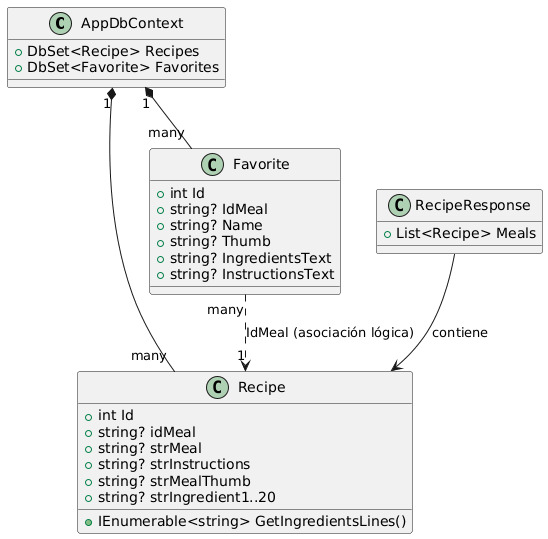
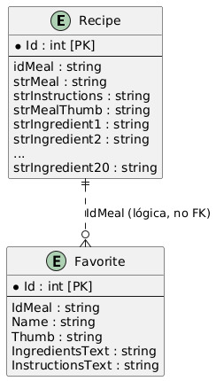

## Documentación del proyecto - SistemasRecetas

Este documento resume la estructura, modelos, controladores, endpoints y comentarios necesarios para comprender el proyecto `SistemasRecetas`.

---

## Resumen del proyecto

Aplicación ASP.NET Core MVC que consulta la API pública TheMealDB para buscar recetas y permite guardar recetas como "favoritos" en una base de datos MySQL usando Entity Framework Core (Pomelo).

Puntos clave:
- Framework: .NET 8 / ASP.NET Core MVC
- ORM: Entity Framework Core (Pomelo MySql provider)
- DBContext: `AppDbContext` con `Recipes` y `Favorites`
- Vistas MVC para mostrar resultados y administrar favoritos

## Archivos principales

- `Program.cs` - Configuración de servicios (DbContext, rutas, middlewares).
- `AppDbContext.cs` - Definición del DbContext y DbSets.
- `Controllers/RecipeController.cs` - Lógica para búsqueda de recetas (llama a TheMealDB) y renderiza `Recipe/Index`.
- `Controllers/FavoritesController.cs` - CRUD para `Favorite` (Index, Add, Create, Edit, Delete).
- `Controllers/HomeController.cs` - Vistas simples (Index, Privacy, Error).
- `Models/Recipe.cs` - Entidad que representa la receta traída de TheMealDB.
- `Models/Favorites.cs` - Entidad para almacenar favoritos en la DB.
- `Models/RecipeResponse.cs` - DTO para deserializar la respuesta de TheMealDB.

## DbContext - AppDbContext

Clase: `AppDbContext` (hereda de `DbContext`)

Propiedades:
- `DbSet<Recipe> Recipes` - colección de recetas (principalmente usada para modelar la respuesta externa).
- `DbSet<Favorite> Favorites` - colección persistente de favoritos.

Constructor:
- `AppDbContext(DbContextOptions<AppDbContext> options)` - configurado en `Program.cs` usando `UseMySql` con la cadena de conexión `DefaultConnection`.

## Modelos (clases) - detalles para UML

1) Recipe

- Namespace: `SistemasRecetas.Models`
- Propiedades:
  - `int Id` [Key]
  - `string? strMeal` (MaxLength 255)
  - `string? strInstructions`
  - `string? strMealThumb` (MaxLength 500)
  - `string? strIngredient1` ... `string? strIngredient20` (20 propiedades, opcionales)
  - `string? idMeal` (id proveniente de TheMealDB, tipo string)

- Métodos:
  - `IEnumerable<string> GetIngredientsLines()` - método que usa reflexión para devolver los ingredientes no nulos/espacios.

Notas UML: `Recipe` es una entidad primaria usada para mapear la respuesta externa. No hay relación explícita en el DbContext entre `Recipe` y `Favorite` (no hay claves foráneas). En diagramas, representarla como clase con muchas propiedades de tipo string (20 ingredientes).

2) Favorite

- Namespace: `SistemasRecetas.Models`
- Propiedades:
  - `int Id` [Key]
  - `string? IdMeal` (MaxLength 20) - corresponde al `idMeal` de `Recipe`
  - `string? Name` (MaxLength 255)
  - `string? Thumb` (MaxLength 500)
  - `string? IngredientsText` - texto con ingredientes (uno por línea)
  - `string? InstructionsText`

Notas UML: `Favorite` es una entidad persistente. Representar como clase con atributos simples. Puede relacionarse lógicamente con `Recipe` por `IdMeal` (asociación 0..* Favorites a 0..1 Recipe) — no implementado como FK, sólo como campo de coincidencia.

3) RecipeResponse

- Propiedades:
  - `List<Recipe> Meals` - DTO de deserialización para la respuesta JSON de TheMealDB.

## Controladores y Endpoints

1) RecipeController

- Ruta base: `/Recipe`
- Acción principal: `Index` (GET) — `/Recipe/Index?name={query}`
  - Si `name` es nulo o vacío devuelve una vista con lista vacía.
  - Permite múltiples queries separadas por coma. Para cada término ejecuta `GetRecipesAsync` en paralelo.
  - Recolecta los `IdMeal` en `Favorites` para desactivar botones en la vista.

- Método estático auxiliar:
  - `GetRecipesAsync(string name)` - realiza llamada HTTP a `https://www.themealdb.com/api/json/v1/1/search.php?s={name}` y deserializa a `RecipeResponse`.

Ejemplo de uso (Query string):
 - /Recipe/Index?name=pizza
 - /Recipe/Index?name=pizza, pasta

Formato de respuesta interno:
- El controlador pasa a la vista una lista de `Recipe` (propiedad `Meals` unida por los resultados de varias búsquedas).

2) FavoritesController

- Ruta base: `/Favorites`
- Acciones disponibles:
  - `Index` (GET) — lista todos los favoritos ordenados por `Name`.
  - `Add` (POST) — añade un favorito pequeño desde `Recipe/Index`. Parámetros: `idMeal`, `name`, `thumb`. Valida duplicados por `IdMeal`.
  - `Create` (GET, POST) — Formulario y acción para crear manualmente un `Favorite` (modelo completo).
  - `Edit` (GET, POST) — Editar favorito por `Id`.
  - `Delete` (POST) — Eliminar favorito por `Id`.

Notas sobre flujo Add:
- `Add` comprueba si `name` está vacío y si `idMeal` ya existe. Usa `TempData` para mensajes de feedback y redirige a `Index`.

3) HomeController

- Rutas: `/Home/Index`, `/Home/Privacy`, `/Home/Error` — vistas estáticas y manejos de errores.

## Vistas

Las vistas se encuentran en `Views/Recipe/Index.cshtml`, `Views/Favorites/*`, `Views/Home/*`. No entramos en detalles del markup, pero:
- `Recipe/Index` itera la lista de `Recipe` y muestra botón para agregar a favoritos (usa `ViewBag.FavIds` para marcar ya agregadas).

## Migraciones y EF Core

- Migraciones existentes en `Migrations/`.
- `README.md` del proyecto contiene los paquetes recomendados y comandos para crear/aplicar migraciones.

Pasos comunes:
- Instalar paquetes NuGet (según README)
- Configurar `DefaultConnection` en `appsettings.json`
- `dotnet ef database update` para aplicar migraciones

## Dependencias clave (extraídas del README y csproj)

- Microsoft.EntityFrameworkCore 9.0.9
- Microsoft.EntityFrameworkCore.Design 9.0.9
- Microsoft.EntityFrameworkCore.Tools 9.0.9
- Pomelo.EntityFrameworkCore.MySql 9.0.0

## Diagramas UML

## Ejemplos JSON (TheMealDB)

Respuesta típica (simplificada):

{
  "meals": [
    {
      "idMeal": "52772",
      "strMeal": "Teriyaki Chicken Casserole",
      "strInstructions": "Mix ...",
      "strMealThumb": "https://www.themealdb.com/images/media/meals/wvpsxx1468256321.jpg",
      "strIngredient1": "soy sauce",
      ...
    }
  ]
}

En C# esto se deserializa a `RecipeResponse` y luego a `List<Recipe>`.

## Cómo ejecutar el proyecto (resumen)

1. Asegúrate de tener .NET 8 SDK instalado.
2. Configura la cadena de conexión `DefaultConnection` en `appsettings.json` apuntando a MySQL/MariaDB.
3. Instala los paquetes NuGet indicados en el `README.md` (si faltan).
4. Aplica migraciones:

   dotnet ef database update

5. Ejecuta la aplicación:

   dotnet run

La ruta por defecto mapea a `Recipe/Index`.

## Casos de borde y notas de diseño

- No hay validación estricta de la longitud en `Recipe` (las propiedades son opcionales y largos variados). `Favorite` sí tiene longitudes y atributos de display.
- `Recipe` modela la respuesta externa completa (incluye 20 ingredientes como propiedades separadas). Para diagramas, puedes representarlas como una lista o expandir las 20 propiedades.
- `GetRecipesAsync` maneja errores devolviendo un `RecipeResponse` con lista vacía — diseño tolerante a fallos de la API externa.
