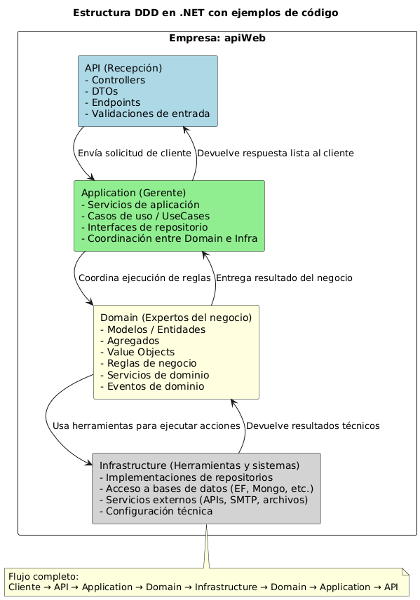
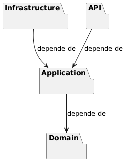
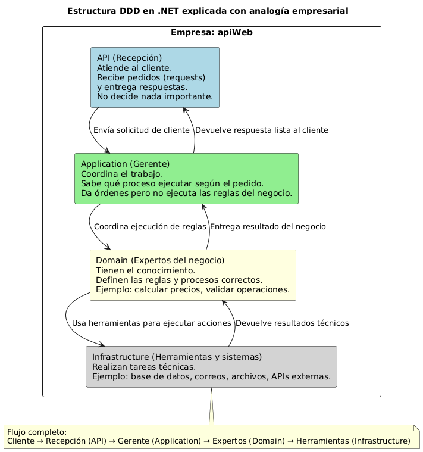

# Creación de una solución con estructura DDD en CSharp

Este documento describe paso a paso cómo crear una solución **.NET** con estructura basada en **Domain-Driven Design (DDD)**, utilizando la línea de comandos.

---

## 1. Crear carpeta del proyecto

```bash
mkdir apiWeb
cd apiWeb
```

---

## 2. Crear la solución principal

```bash
dotnet new sln -n solution
```

> Crea un archivo de solución (`solution.sln`) que agrupará todos los proyectos.

---

## 3. Crear los proyectos según las capas DDD

### API (Capa de Presentación)

```bash
dotnet new webapi -n apiWeb.Api
```

> Genera una **Web API ASP.NET Core**, punto de entrada de la aplicación.

---

### Application (Capa de Aplicación)

```bash
dotnet new classlib -n apiWeb.Application
```

> Contiene los **casos de uso**, la **lógica de aplicación** y la **orquestación** entre el dominio e infraestructura.

---

### Domain (Capa de Dominio)

```bash
dotnet new classlib -n apiWeb.Domain
```

> Define las **entidades**, **agregados**, **value objects**, **interfaces** y **servicios de dominio**.

---

### Infrastructure (Capa de Infraestructura)

```bash
dotnet new classlib -n apiWeb.Infrastructure
```

> Contiene las implementaciones concretas de persistencia, acceso a datos, HTTP clients, etc.

---



---

## 4. Agregar los proyectos a la solución

```bash
dotnet sln add apiWeb.Api/
dotnet sln add apiWeb.Application/
dotnet sln add apiWeb.Domain/
dotnet sln add apiWeb.Infrastructure/
```

---

## 5. Establecer las referencias entre capas

```bash
dotnet add apiWeb.Api reference apiWeb.Application
dotnet add apiWeb.Application reference apiWeb.Domain
dotnet add apiWeb.Infrastructure reference apiWeb.Application
```

> Esto mantiene las dependencias limpias según las reglas de DDD.
>
> - La **API** depende de **Application**.
> - **Application** depende de **Domain**.  
> - **Infrastructure** puede depender de **Application** y **Domain**.



---

## 6. Restaurar dependencias y verificar

```bash
dotnet restore
dotnet build
```

> Verifica que todos los proyectos estén correctamente enlazados y compilados.

---

## Estructura resultante

```bash
apiWeb/
│
├── solution.sln
├── apiWeb.Api/
├── apiWeb.Application/
├── apiWeb.Domain/
└── apiWeb.Infrastructure/
```

---

## Ejemplo de como funciona DDD



---

## Resultado

Solución .NET lista para implementar una arquitectura basada en DDD, con separación clara entre capas de dominio, aplicación, infraestructura y presentación.

---
