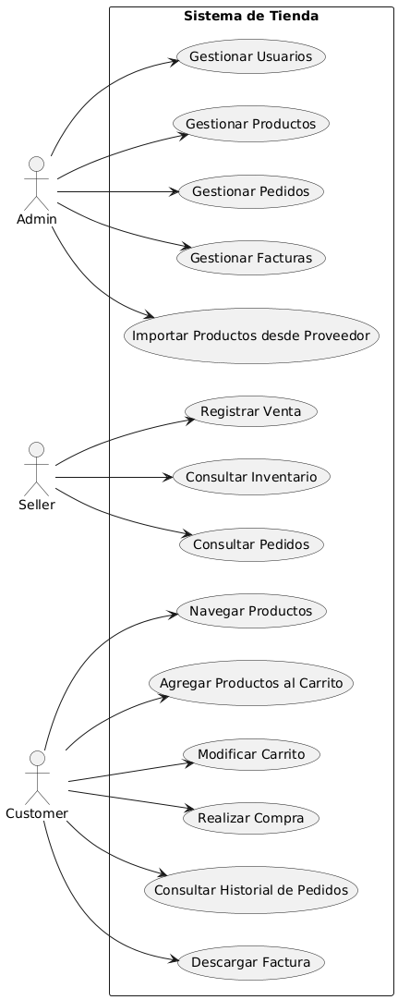
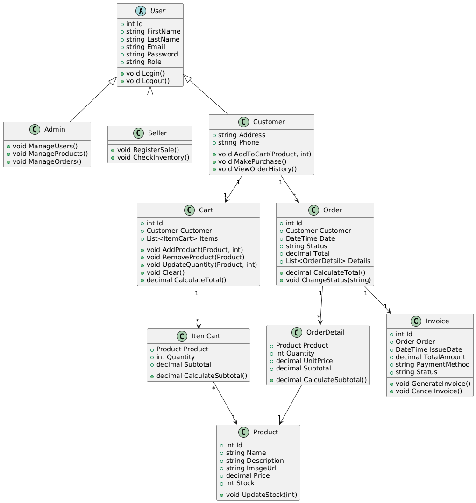
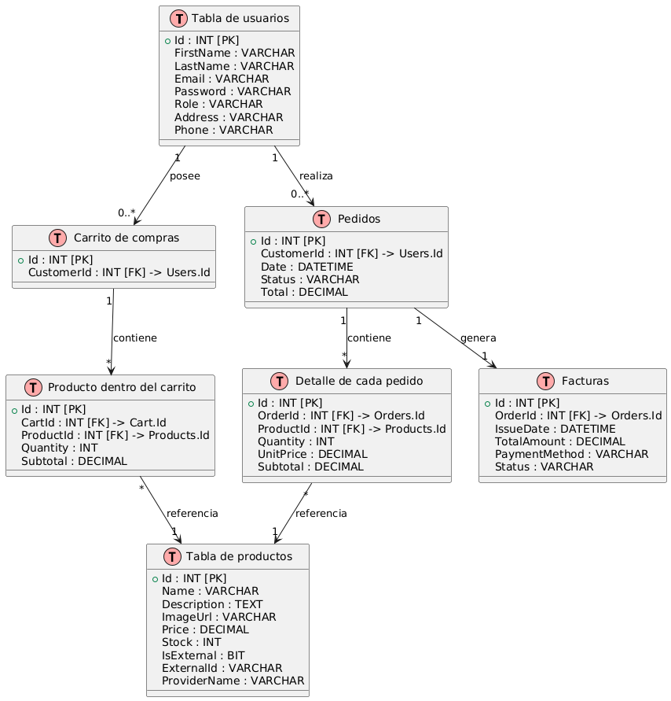

# Contexto del Proyecto: Sistema de Tienda Online

## 1. Descripción general

El proyecto consiste en el desarrollo de una **plataforma de tienda en línea** utilizando el patrón de arquitectura **MVC (Model-View-Controller)**.  
El sistema permitirá la gestión completa de productos, ventas y usuarios, brindando diferentes roles (Administrador, Vendedor y Cliente) con funciones específicas.  

El objetivo principal es proporcionar una aplicación modular, escalable y segura que permita **administrar el flujo completo de compra**, desde la selección de productos hasta la generación de facturas.

---

## 2. Objetivos del sistema

### Objetivo general

Diseñar e implementar un sistema de gestión de tienda en línea que permita administrar usuarios, productos, pedidos y facturas de manera eficiente.

### Objetivos específicos

- Permitir el registro y autenticación de usuarios según su rol.  
- Gestionar productos disponibles en el catálogo (crear, editar, eliminar, listar).  
- Facilitar el proceso de compra a través de un carrito de compras dinámico.  
- Registrar pedidos generados por los clientes y su correspondiente facturación.  
- Proporcionar al administrador herramientas para la gestión de usuarios y ventas.  
- Integrar un módulo de “Proveedor” que permita al administrador importar productos de una API externa al catálogo local.

---

## 3. Roles del sistema

| Rol | Descripción | Funcionalidades principales |
|-----|--------------|-----------------------------|
| **Administrador** | Supervisa el sistema completo. | CRUD de usuarios, productos, pedidos y facturas. Importar productos desde proveedor/API. |
| **Vendedor** | Gestiona ventas y control de stock. | Registrar ventas, revisar inventario, consultar pedidos. |
| **Cliente** | Usuario final que compra productos. | Agregar productos al carrito, realizar pedidos, ver historial, descargar facturas. |

---

## 4. Flujo general del sistema

### 4.1 Compra de productos

1. El **cliente** navega por los productos y los agrega al **carrito de compras**.  
2. Al confirmar la compra, se genera un **pedido (Order)** con sus respectivos **detalles (OrderDetail)**.  
3. Una vez completado el pago, se crea una **factura (Invoice)** asociada al pedido.  
4. El **vendedor o administrador** puede consultar, modificar o gestionar pedidos y facturas.  
5. El **administrador** mantiene el control de usuarios, roles y catálogo de productos.

### 4.2 Módulo "Proveedor" (solo administrador)

1. El administrador accede a la vista **Proveedor**.  
2. La vista consume la API del proveedor y **muestra productos disponibles** (solo lectura).  
3. El administrador selecciona un producto y define la cantidad que desea agregar.  
4. El producto seleccionado se **agrega a la base de datos local** (`Product`).  
5. A partir de ese momento, el producto se gestiona normalmente mediante el CRUD del sistema.

> Nota: La API del proveedor **solo se muestra en la vista** para agregar productos. No reemplaza el CRUD local ni modifica los productos existentes en la base.

---

## 5. Principales entidades del sistema

### 5.1 User (abstracta)

**Propósito:** clase base para todos los tipos de usuario.  
**Atributos:**

- `Id` *(clave primaria)*  
- `Nombre`  
- `Apellido`  
- `Correo`  
- `Contraseña`  
- `Rol` *(Admin, Vendedor, Cliente)*  

**Métodos:**

- `IniciarSesion()`  
- `CerrarSesion()`  

### 5.2 Admin, Seller, Customer

- Heredan de `User`.  
- Admin: gestión de usuarios, productos, pedidos y módulo proveedor.  
- Seller: registrar ventas, revisar inventario.  
- Customer: agregar productos al carrito, realizar pedidos, ver historial.

### 5.3 Product

- `Id`  
- `Nombre`  
- `Descripcion`  
- `Precio`  
- `Stock`  
- `ImageUrl` *(URL de la imagen del producto)*  

**Métodos:**

- `ActualizarStock(cantidad)`

### 5.4 Cart / ItemCart

- **Cart**: lista temporal de productos que el cliente quiere comprar.  
- **ItemCart**: representa un producto dentro del carrito con cantidad y subtotal.

**Cart:**

- `Id`  
- `Customer`  
- `List<ItemCart> Items`  

**Métodos:**

- `AgregarProducto(Product, cantidad)`  
- `EliminarProducto(Product)`  
- `ActualizarCantidad(Product, cantidad)`  
- `Vaciar()`  
- `CalcularTotal()`

**ItemCart:**

- `Producto`  
- `Cantidad`  
- `Subtotal`  
- `CalcularSubtotal()`

### 5.5 Order / OrderDetail

- **Order**: venta confirmada.  
- **OrderDetail**: cada producto incluido en el pedido.

**Order:**

- `Id`  
- `Customer`  
- `Fecha`  
- `Estado` (Pendiente, Pagado, Entregado)  
- `Total`  
- `List<OrderDetail> Detalles`  

**Métodos:**

- `CalcularTotal()`  
- `CambiarEstado(nuevoEstado)`

**OrderDetail:**

- `Producto`  
- `Cantidad`  
- `PrecioUnitario`  
- `Subtotal`  
- `CalcularSubtotal()`

### 5.6 Invoice

- `Id`  
- `Order` *(pedido asociado)*  
- `FechaEmision`  
- `MontoTotal`  
- `MetodoPago`  
- `Estado` (Pagada, Pendiente, Anulada)  

**Métodos:**

- `GenerarFactura()`  
- `AnularFactura()`

## 5.7 Esquema de base de datos (simplificado)

---

## 6. Tecnologías propuestas

- **Lenguaje:** C# (.NET 8, ASP.NET Core MVC)  
- **Base de datos:** MySQL o SQL Server  
- **ORM:** Entity Framework Core  
- **Frontend:** Razor Pages, HTML5, CSS3, Bootstrap  
- **Control de versiones:** Git + GitHub  
- **IDE:** Visual Studio o Rider
