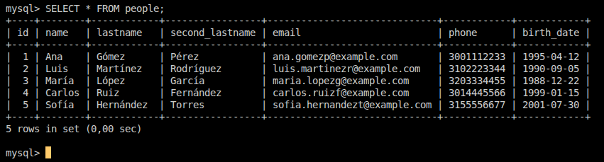
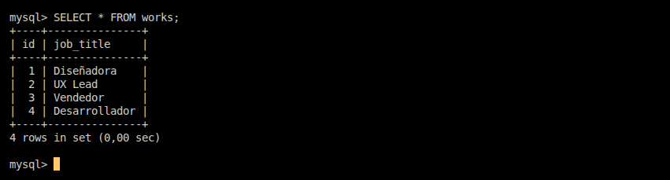
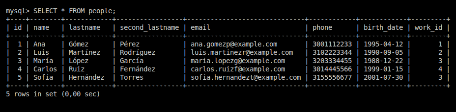

# Api Base de datos con MySQL

---

## Creacion de la base de datos y tablas en MySQL

Cree una base de datos en MySQL llamada `mydatabase`
`sudo mysql`
`CREATE DATABASE mydatabase;`

Ingreso a mi base de datos para comenzar a usarla
`USE mydatabase`

### Creare una tabla que se llame `people` para almacenar los datos de las personas como

- id
- name
- lastname
- second_lastname
- email
- phone
- birth_date

```sql
CREATE TABLE people (
    id INT AUTO_INCREMENT PRIMARY KEY,
    name VARCHAR(100) NOT NULL,
    lastname VARCHAR(100) NOT NULL,
    second_lastname VARCHAR(100) NOT NULL,
    email VARCHAR(150) NOT NULL,
    phone VARCHAR(20) NOT NULL,
    birth_date DATE NOT NULL
)
```

Ingreso datos a la tabla `people`

```sql
INSERT INTO people (name, lastname, second_lastname, email, phone, birth_date) VALUES
('Ana', 'Gómez', 'Pérez', 'ana.gomezp@example.com', '3001112233', '1995-04-12'),
('Luis', 'Martínez', 'Rodríguez', 'luis.martinezr@example.com', '3102223344', '1990-09-05'),
('María', 'López', 'García', 'maria.lopezg@example.com', '3203334455', '1988-12-22'),
('Carlos', 'Ruiz', 'Fernández', 'carlos.ruizf@example.com', '3014445566', '1999-01-15'),
('Sofía', 'Hernández', 'Torres', 'sofia.hernandezt@example.com', '3155556677', '2001-07-30');
```



---

### Creare una tabla que se llame `trabajos` para almacenar los trabajos y asociarlos a personas

Creo la tabla `works` para almanecar varios trabajos

```sql
CREATE TABLE works (
    id INT AUTO_INCREMENT PRIMARY KEY,
    job_title VARCHAR(100) NOT NULL
);
```

Ingreso trabajos a la tabla

```sql
INSERT INTO works (job_title) VALUES
('Diseñadora'),
('UX Lead'),
('Vendedor'),
('Desarrollador');
```



---

**Ahora** tengo que modifical la tabla de `people` para agregar la columna de trabajo_id para asocialo a cada persona

```sql
ALTER TABLE people
ADD work_id INT,
ADD FOREIGN KEY (work_id) REFERENCES works(id);
```

```sql
UPDATE people SET work_id = 1 WHERE id = 1; -- Ana → Diseñadora
UPDATE people SET work_id = 2 WHERE id = 2; -- Luis → UX Lead
UPDATE people SET work_id = 3 WHERE id = 3; -- María → Vendedor
UPDATE people SET work_id = 4 WHERE id = 4; -- Carlos → Desarrollador
UPDATE people SET work_id = 3 WHERE id = 5; -- Sofía → Vendedor
```



works es un catálogo fijo de trabajos. people guarda solo el work_id y no repite el nombre del puesto.
Con esto queda lista la base datos que vamos a utilizar.

---

Cree dos carpetas, Backend y Frontend.

En la carpeta del Backend instalamos.
`express`,`mysql2`,`csv-parser`,`multer`,`cors`,`dotenv`

Cree un archivo `mydatabase.sql` donde tengo todos los comandos para la creacion de la base de datos MySQL.

```js
npm init -y

npm i express mysql2 csv-parser multer cors dotenv
```

---

### Backend

Cree un `.env` donde voy a guardar las credenciales/conección de mi base de datos MySQL.

Cree un archivo `db.js` encargado de establecer y exportar la conexión a la base de datos MySQL para que cualquier otro archivo del proyecto pueda usarla sin tener que volver a configurar la conexión.

Cree un archivo `index.js` en el BACKEND

Es el punto de entrada del servidor Node.js/Express:
    - Levanta el servidor (app.listen(3000))
    - Carga configuraciones y middlewares (JSON parsing, CORS, rutas…).
    - Importa tu conexión (db.js) y la usa para hacer consultas.
    - Define los endpoints que responden a las peticiones del frontend (GET, POST, PUT, DELETE).

### Frontend

Cree un archivo `index.js` en el FRONTEND

Es el archivo principal de JavaScript del index.html:
    - Maneja el DOM (lo que el usuario ve y toca).
    - Hace peticiones al backend usando fetch o Axios.
    - Actualiza la interfaz según la respuesta.
    - Manejar eventos (clicks, formularios, etc.).
